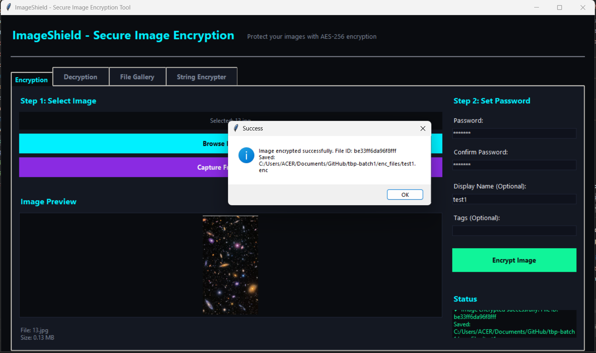
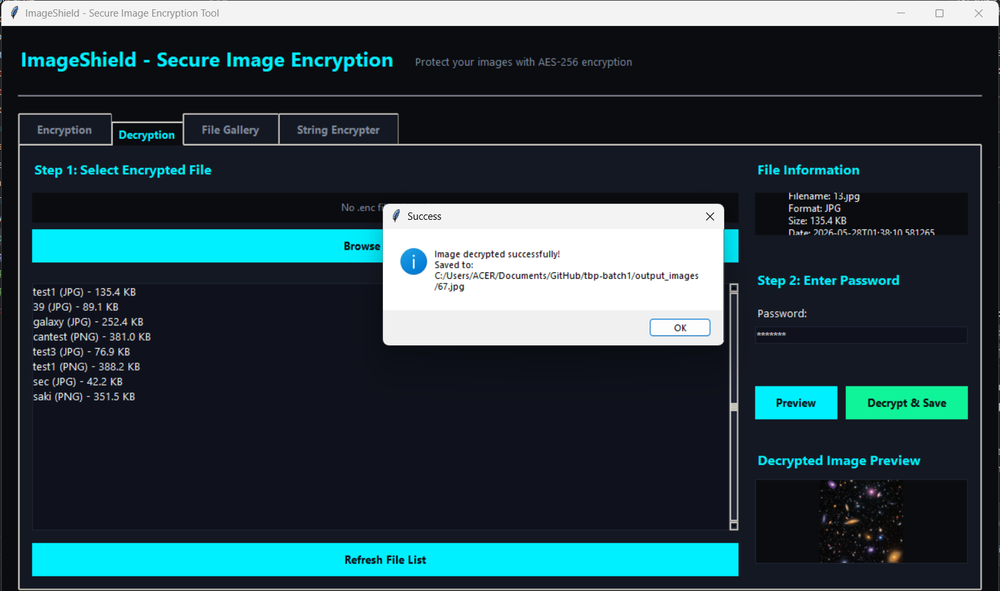
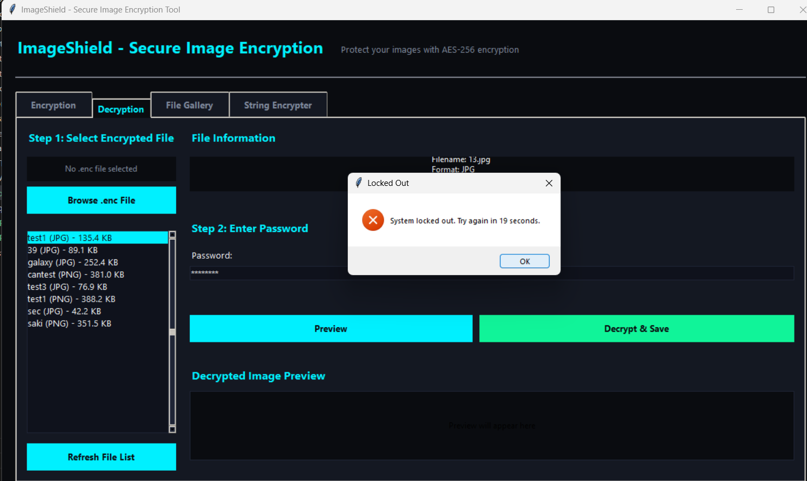
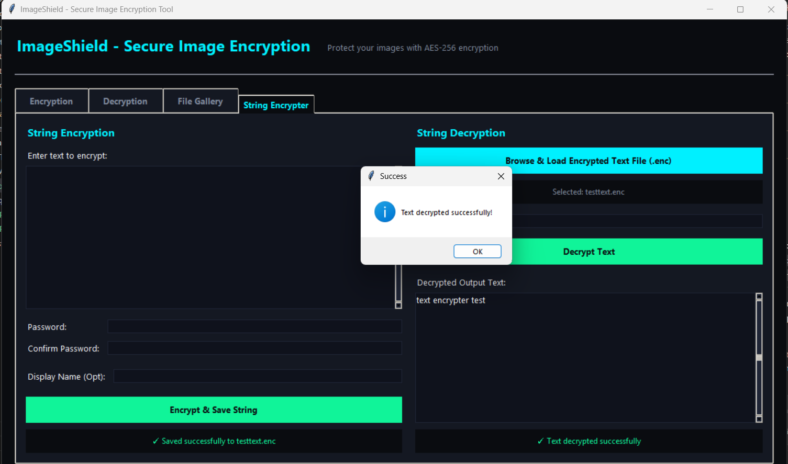
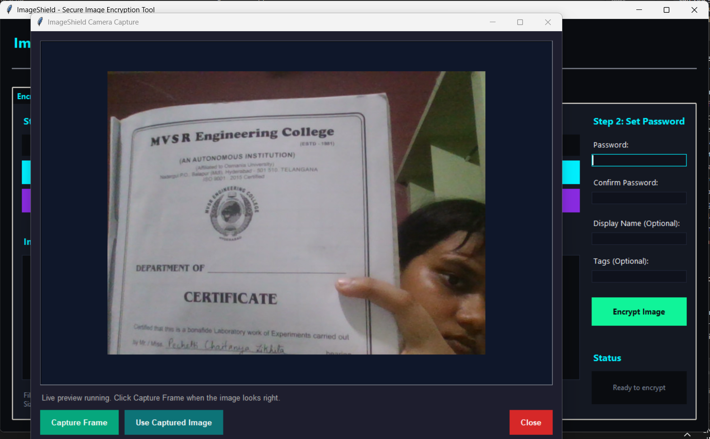
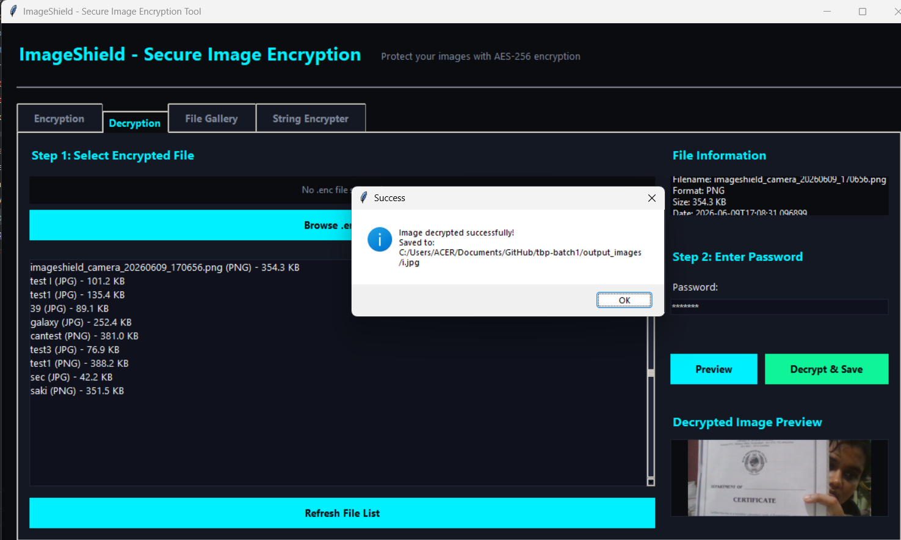

# ImageShield - Secure Image & String Encryption Platform

A premium, modern offline desktop security application for securely encrypting and decrypting JPG/PNG images and sensitive text strings. Built with a stunning **Obsidian Neon Theme**, utilizing advanced password-based AES encryption with custom integrity guarantees, OpenCV camera capture, and real-time brute-force protection.

**Project**: BE CSE(IoT-CS-BCT) – Sem IV 2026 Batch-No: 1  
**College**: MVSR Engineering College  
**Guide**: M. Anupama, Assoc. Prof, Dept. of CSE, MVSREC  

---

## Team Members

1. **P. Chaitanya Likhita** (Team Lead) - 2451-24-749-045
2. **J. Reshmika** - 2451-24-749-022
3. **N. Meghana** - 2451-24-749-041

---

## Key Upgrades & Features

### Neon UI/UX
- **Modern HSL Aesthetic**: Built on a sophisticated dark theme using **Deep Space Obsidian (`#0A0C10`)**, **Carbon Dark Slate (`#141822`)**, and **Recessed Slate (`#0F121C`)** inputs.
- **Button Micro-Animations**: Standard widgets are wrapped with `<Enter>` and `<Leave>` binding helpers to transition background colors dynamically upon cursor entry.
- **Active Glow Inputs**: Flat modern entry fields feature dynamic active border glows in **Holographic Neon Cyan (`#00F0FF`)** upon mouse focus.
- **Clean Cohesive Typography**: Fully configured using `Segoe UI` fonts with distinct visual hierarchies, and `Consolas` for secure cryptographic keys.

### Standalone String Encrypter (4th Tab)
- **Text Cryptographic Pipeline**: Multi-line textbox input supporting secure arbitrary string encryption and local recovery.
- **Self-Contained JSON Packages**: Encrypted text is exported as a highly portable secure `.enc` JSON package storing the base64 ciphertext, randomized salt, and a custom HMAC-SHA256 signature.
- **Shared Lockout State**: Automatically synchronizes with the core `SecurityController`. Incorrect passwords entered during string decryption decrement remaining attempts and trigger the timer globally.

### Live Camera Capturing
- **Webcam Integration**: Integrates directly with OpenCV (`cv2`) to capture real-time camera frames and feed them instantly into the encryption pipeline, ensuring secure stream-to-disk protection.

### Hardened Cryptographic Layer
- **AES-128 Symmetric Ciphers**: Deployed using high-performance block ciphers via Python's standard `cryptography` Fernet module.
- **PBKDF2 Key Derivation**: High-grade key stretching over **100,000 SHA-256 iterations** with randomized 16-byte salts, defeating offline dictionary attacks.
- **HMAC-SHA256 Data Integrity**: Cryptographic signing prevents tampering or modification of files on disk.
- **Stateful Lockout Manager**: Enforces a strict **30-second system lock** after three consecutive failed password entry attempts, featuring an active real-time countdown timer.

---

## Project Architecture & File Structure

```
tbp-batch1/
├── main.py                  # Main loader & application thread manager
├── backend.py               # Orchestrator, cryptography engines, and SQLite data models
├── frontend.py              # Obsidian Neon Tkinter GUI (Tabs, dynamic layout & hover bindings)
├── livecam.py               # OpenCV webcam loop capture utility
├── requirements.txt         # Python package dependencies
└── README.md                # Platform documentation (This file)
```

### Database Schema

SQLite databases maintain local logs and records. Password values or plain Master Keys are **never** stored on disk.

#### `encrypted_files` Table
```sql
CREATE TABLE encrypted_files (
    id INTEGER PRIMARY KEY AUTOINCREMENT,
    file_id TEXT UNIQUE NOT NULL,
    original_filename TEXT NOT NULL,
    file_format TEXT NOT NULL,
    encrypted_data BLOB NOT NULL,
    file_size INTEGER NOT NULL,
    encryption_date TIMESTAMP,
    hmac_tag TEXT NOT NULL,
    salt TEXT NOT NULL,
    tags TEXT
);
```

#### `metadata_index` Table
```sql
CREATE TABLE metadata_index (
    id INTEGER PRIMARY KEY AUTOINCREMENT,
    file_id TEXT UNIQUE NOT NULL,
    filename TEXT NOT NULL,
    format TEXT NOT NULL,
    size INTEGER,
    date TIMESTAMP,
    FOREIGN KEY (file_id) REFERENCES encrypted_files(file_id)
);
```

---

##  Installation & Setup

### Prerequisites
- Python 3.8 or higher
- pip (Python Package Manager)

### Step-by-Step Installation

1. **Clone the repository**
   ```bash
   cd tbp-batch1
   ```

2. **Install Dependencies**
   ```bash
   pip install -r requirements.txt
   ```
   Dependencies managed in `requirements.txt`:
   - `cryptography>=41.0.0` - Symmetric ciphers, key derivation, and PBKDF2 stretching
   - `Pillow>=10.0.0` - GUI image normalizations and previews
   - `opencv-python>=4.10.0` - Webcam interface capture loops

3. **Verify Dependencies**
   ```bash
   python -c "import cryptography; import PIL; import cv2; print('✓ All premium dependencies installed successfully!')"
   ```

---

## Running the Application

Launch the platform using the main loader:
```bash
python main.py
```
*Note: This starts the main loop, initializing the database tables and bootstrapping the Obsidian Neon interface.*

---

## Comprehensive Verification Matrix (Chapter 5)

The following test execution cases have been thoroughly executed and verified:

| Test ID | Scenario | Expected Result | Status | Verification Screenshot |
| :--- | :--- | :--- | :--- | :--- |
| **TC-01** | Successful Image Encryption | Raw image encrypted, stored in SQLite database, and `.enc` metadata written | **PASS** | [View Encryption Success](#tc-01-successful-image-encryption) |
| **TC-02** | Successful Image Decryption | Original image fully recovered from SQLite, verified for integrity, and restored | **PASS** | [View Decryption Success](#tc-02-successful-image-decryption) |
| **TC-03** | Incorrect Password Entry | Decryption fails, remaining attempt count decremented, and user warning displayed | **PASS** | [View Decryption Failed](#tc-03-incorrect-password-entry) |
| **TC-04** | Brute-Force Lockout | Stateful controller triggers strict 30-second lock after 3 failures with real-time timer | **PASS** | [View Lockout Timer](#tc-04-brute-force-lockout) |
| **TC-05** | String Encryption Pipeline | String input successfully converted to `.enc` JSON package and recovered cleanly | **PASS** | [View Text Encryption](#tc-05-string-encryption-pipeline) |
| **TC-06** | Live Camera Capture | Live webcam stream loaded and preview window displayed | **PASS** | [View Live Camera Capture](#tc-06-live-camera-capture) |
| **TC-07** | Live Video Frame Encryption | Webcam frame captured, successfully encrypted, and saved to database/local file | **PASS** | [View Live Video Encryption](#tc-07-live-video-frame-encryption) |

### Test Execution Gallery

Here are the visual verifications corresponding to each execution test case:

#### **TC-01: Successful Image Encryption**
*Visual proof of raw image database insertion and secure encryption routine.*


---

#### **TC-02: Successful Image Decryption**
*Visual proof of authenticated decryption and safe original image reconstruction.*


---

#### **TC-03: Incorrect Password Entry**
*Visual proof of integrity check failure and user decryption warnings.*


---

#### **TC-04: Brute-Force Lockout**
*Visual proof of security lockout trigger and dynamic 30-second cooldown timer active state.*


---

#### **TC-05: String Encryption Pipeline**
*Visual proof of the standalone string cryptographic pipeline outputting base64-salted enc packages.*


---

#### **TC-06: Live Camera Capture**
*Visual proof of webcam live video stream and camera capture window interface.*


---

#### **TC-07: Live Video Frame Encryption**
*Visual proof of webcam video frame capture, database verification, and secure local file encryption.*


---

## Troubleshooting & Notes

- **"Module 'cv2' not found"**: Ensure you have successfully run `pip install -r requirements.txt` to install the OpenCV bindings.
- **Database Locked Error**: Close any redundant background instances of `main.py` or relational DBMS viewers pointing to `imageshield.db`.
- **String Decryption Recovery**: Standalone text `.enc` packages must be decrypted using the identical password key set during encryption. Due to high-grade security stretching, there are no default "master backdoors" or bypass pathways.

---

## Performance Benchmarks

- **Key Stretching Speed**: Under PBKDF2 with 100,000 iterations of SHA-256, key derivation completes in **<0.15s** on modern processors, maintaining high user experience while offering server-grade protection.
- **UI Responsiveness**: All cryptographic processing is run on dedicated background execution threads (via Python's `threading` library) to ensure the Tkinter GUI loop remains fluid and never freezes.

---

## Support & Guide Contacts

For academic verification or guidance enquiries:
- **Project Team**: P. Chaitanya Likhita (Team Lead), J. Reshmika, N. Meghana
- **Project Guide**: M. Anupama (Assoc. Prof, Dept. of CSE-Allied)
- **Institution**: MVSR Engineering College (Autonomous), Department of CSE-Allied

---

**Last Updated**: June 9, 2026
